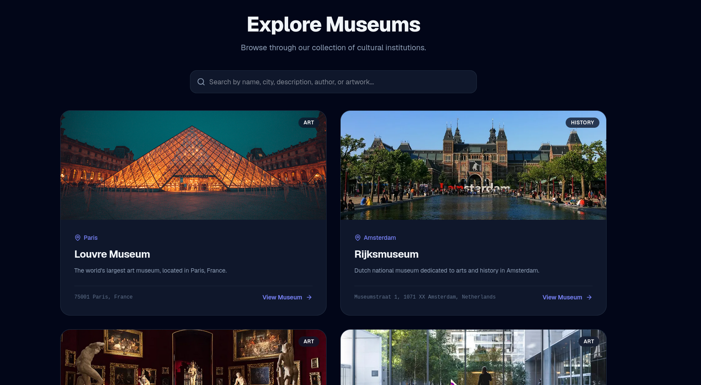
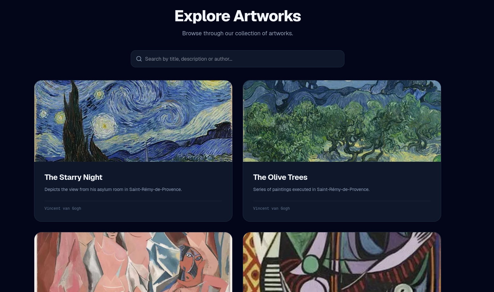

# Virtual Museum

A comprehensive web-based information system designed to digitize and promote cultural heritage. It allows users to virtually visit museums, search for specific artworks by various criteria, and view detailed multimedia galleries. The system also includes a secure administrative panel for complete content management.

## Images

## Note

This is for an university assignment
